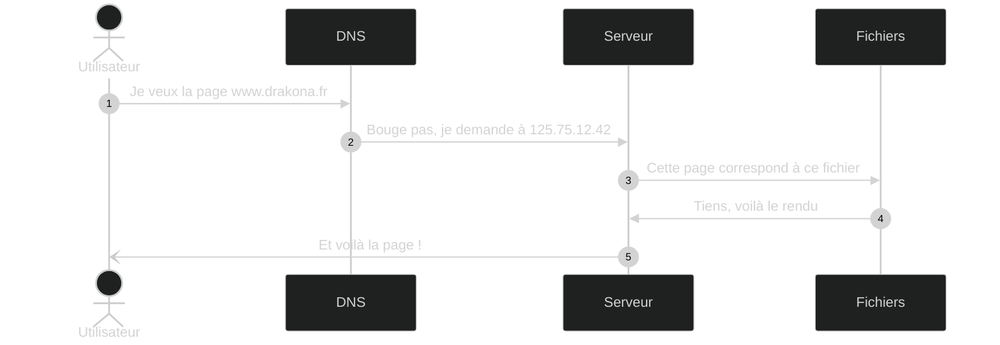
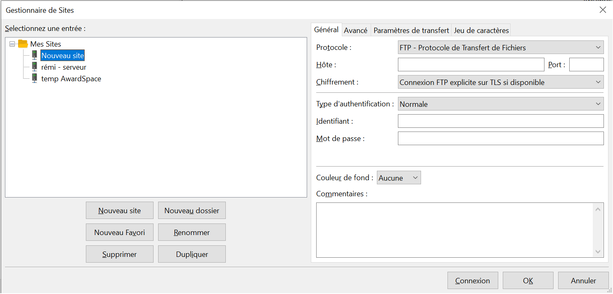

# Déployer une application

[[toc]]

## Un serveur, comment ça marche ?

Les étapes représentées dans le schéma ci-dessus :
1. Un utilisateur demande le site `https://www.drakona.fr`.
2. La requête est transmise à un serveur <abbr title="Domain Name System">DNS</abbr>, qui va faire le lien entre le nom de domaine et une adresse IP.
3. La requête est transmise à cette adresse IP, qui correspond à un serveur, sur lequel est installé un serveur Web (Nginx / Apache / Caddy / etc).
4. Le serveur Web fait le lien entre l'url demandée et un ensemble de fichiers et ces fichiers sont interprétés / exécutés.
5. Le serveur Web renvoie la réponse à l'utilisateur.

On pourrait ajouter d'autres étapes (ce qu'il se passe au sein du serveur), mais c'est une autre histoire ;).

## DevOps

La mise en place d'un processus de déploiement (un script pour l'automatiser) relève souvent du travail du DevOps.

> DevOps est un ensemble de pratiques et d'outils, ainsi qu'une philosophie culturelle. Son but est d'automatiser et d'intégrer les processus entre les équipes de développement et informatiques. DevOps met l'accent sur l'autonomisation des équipes, la communication et la collaboration transverses ainsi que l'automatisation technologique.
>
> -- <cite>[Atlassian](https://www.atlassian.com/fr/devops)</cite>

On parle de DevOps pour désigner un ensemble de méthodes de travail, permettant de simplifier la communication et le travail des développeurs et des équipes opérationnelles (d'où DevOps).
Le but est de "*graisser les rouages*" et de faciliter le travail des équipes, en général en automatisant certaines tâches (<abbr title="Continuous Integration">CI</abbr> / <abbr title="Continuous Deployment">CD</abbr>, pipelines, Actions, etc.).

## Environnements

Souvent, nos réalisations vont devoir être vérifiés par plusieurs personnes, pour vérifier la conformité avec la demande initiale :
- soit même : environnement de travail local, pour développer et voir le résultat de ce que l'on produit + tests unitaires et fonctionnels automatiques
- nos pairs / notre équipe : [SIT](https://en.wikipedia.org/wiki/System_integration_testing) ou [Test d'intégration](https://fr.wikipedia.org/wiki/Test_d%27int%C3%A9gration)
- Vérification par le client : [UAT](https://uit.stanford.edu/pmo/UAT) ou [Test de validation](https://fr.wikipedia.org/wiki/Test_de_validation)

Ensuite vient la mise en production, c'est-à-dire mettre la dernière version à disposition des clients finaux de l'application.

Toutes ces étapes nécessitent un déploiement sur un environnement différent, d'où la nécessité d'avoir un processus fixe.

De la même manière, ces différents environnements ne vont pas présenter exactement les mêmes développements (ou même tickets) en même temps. Ce qui implique une méthodologie de travail, pour s'y retrouver.

## FTP, SCP et SSH

### Déploiement par FTP

En vidéo :

<iframe src="https://www.loom.com/embed/c66268b37c624ca6a801362cb87b9bd0" frameborder="0" webkitallowfullscreen mozallowfullscreen allowfullscreen style="position: absolute; top: 0; left: 0; width: 100%; height: 100%;"></iframe>

Le FTP est un protocole de transfert de fichiers, permettant de se connecter à un serveur pour mettre en ligne des fichiers ou en récupérer depuis un serveur. Il peut s'utiliser en ligne de commande, ou en utilisant des interfaces graphiques, comme [FileZilla](https://filezilla-project.org/download.php?show_all=1).

Il est très utile pour les sites simples (HTML, JS, CSS), ne nécessitant pas de lancer des commandes sur le serveur ou si le serveur n'offre pas d'accès SSH.

Pour déployer un site en FTP, nous avons besoin : 
- de l'adresse du site (IP ou nom de domaine)
- d'un port à utiliser
- d'un identifiant et d'un mot de passe **ou** d'une clé SSH valide (ajoutée au serveur)
- de [FileZilla](https://filezilla-project.org/download.php?show_all=1) ou d'un outil de FTP équivalent.

### Configurer FileZilla

Les options par défaut de FileZilla font en général très bien l'affaire, si bien que nous avons seulement besoin de configurer l'accès à notre site.

Pour cela, ouvrez le gestionnaire de sites (`Fichiers > Gestionnaire de sites...` ou le bouton "Gestionnaire de sites" en haut à gauche) et entrez les informations requises.

- Protocole : FTP ou SFTP sont les deux options les plus courantes (nous allons choisir SFTP)
- Hôte : adresse IP ou nom de domaine fourni par l'hébergeur
- Chiffrement (apparait si connexion FTP) : vous permet de dire comment chiffrer la connexion (à voir selon l'hébergement)
- Type d'authentification : je vous recommande `Normale` (qui permet de retenir identifiant **et** mot de passe)

Une fois les informations entrées, plus qu'à cliquer sur `Connexion` pour tester et parcourir les fichiers.

### Transférer des fichiers

Cette partie est très simple, il suffit de déplacer les fichiers d'un côté de l'interface à l'autre.

## Exemple pratique

[Wordpress](./10-wordpress.md)
