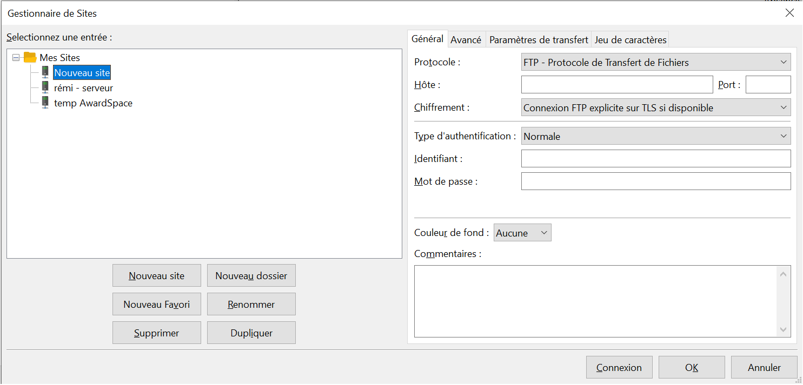

# Déploiement par FTP

[[toc]]

En vidéo :

<iframe src="https://www.loom.com/embed/c66268b37c624ca6a801362cb87b9bd0" frameborder="0" webkitallowfullscreen mozallowfullscreen allowfullscreen style="position: absolute; top: 0; left: 0; width: 100%; height: 100%;"></iframe>

Le FTP est un protocole de transfert de fichiers, permettant de se connecter à un serveur pour mettre en ligne des fichiers ou en récupérer depuis un serveur. Il peut s'utiliser en ligne de commande, ou en utilisant des interfaces graphiques, comme [FileZilla](https://filezilla-project.org/download.php?show_all=1).

Il est très utile pour les sites simples (HTML, JS, CSS), ne nécessitant pas de lancer des commandes sur le serveur ou si le serveur n'offre pas d'accès SSH.

Pour déployer un site en FTP, nous avons besoin : 
- de l'adresse du site (IP ou nom de domaine)
- d'un port à utiliser
- d'un identifiant et d'un mot de passe **ou** d'une clé SSH valide (ajoutée au serveur)
- de [FileZilla](https://filezilla-project.org/download.php?show_all=1) ou d'un outil de FTP équivalent.

## Configurer FileZilla

Les options par défaut de FileZilla font en général très bien l'affaire, si bien que nous avons seulement besoin de configurer l'accès à notre site.

Pour cela, ouvrez le gestionnaire de sites (`Fichiers > Gestionnaire de sites...` ou le bouton "Gestionnaire de sites" en haut à gauche) et entrez les informations requises.

- Protocole : FTP ou SFTP sont les deux options les plus courantes (nous allons choisir SFTP)
- Hôte : adresse IP ou nom de domaine fourni par l'hébergeur
- Chiffrement (apparait si connexion FTP) : vous permet de dire comment chiffrer la connexion (à voir selon l'hébergement)
- Type d'authentification : je vous recommande `Normale` (qui permet de retenir identifiant **et** mot de passe)

Une fois les informations entrées, plus qu'à cliquer sur `Connexion` pour tester et parcourir les fichiers.

## Transférer des fichiers

Cette partie est très simple, il suffit de déplacer les fichiers d'un côté de l'interface à l'autre.
