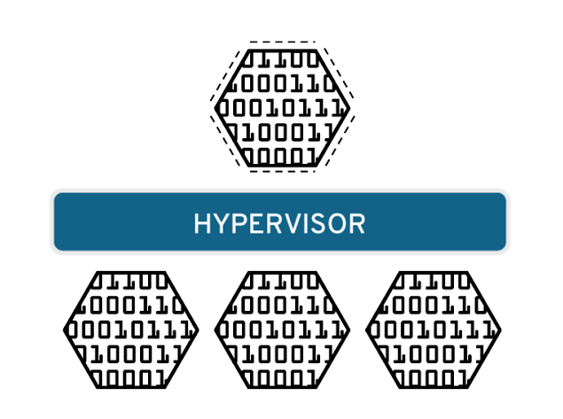
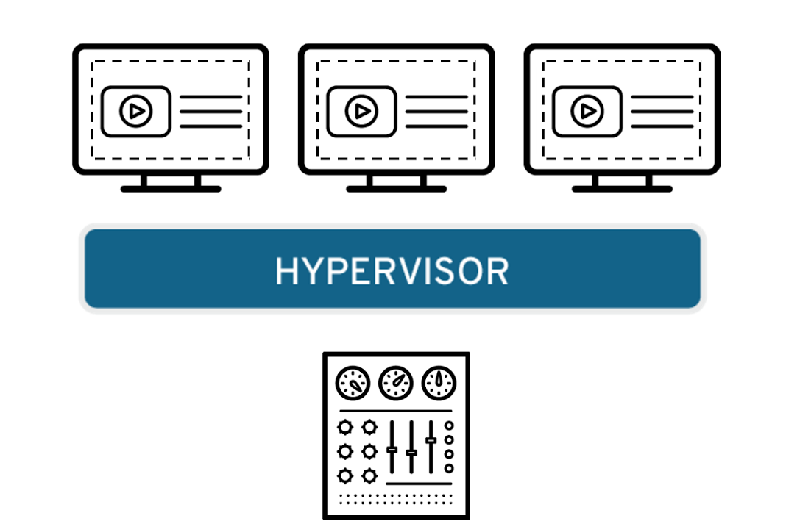
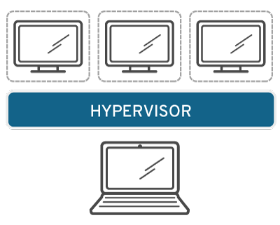
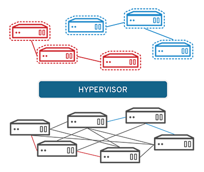
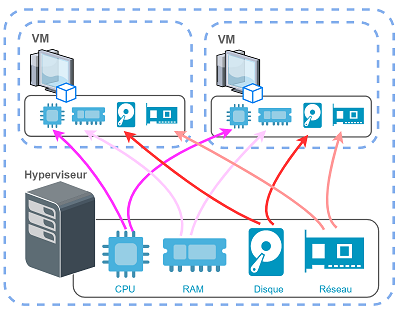
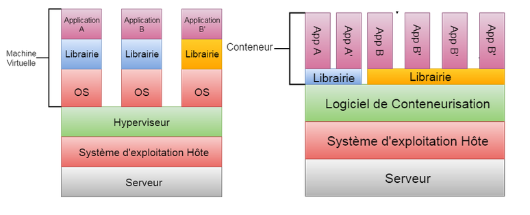

## Virtualisation

- Des machines dans la machine
- Hyperviseurs

En vidéo : 

<iframe src="https://www.loom.com/embed/bd25adc5530647f1a57a3cd0f50db521" frameborder="0" webkitallowfullscreen mozallowfullscreen allowfullscreen style="position: absolute; top: 0; left: 0; width: 100%; height: 100%;"></iframe>

### Historique

- Développée dans les années 70-80.
- Popularisée dans les années 90 (émulateurs de vieilles machines).
- Véritable boom ensuite dans les environnements de travail.
- Très utilisée de nos jours dans les grands parcs informatiques (y compris hébergeurs).

### Intérêts

- Une VM fonctionne de manière identique quel que soit l'hôte (en théorie).
- Allocation de resources dynamiques.
- Mutualisation des resources.
- Destructible/redimensionnable à l'infini sans casser l'hôte.
- Isolation des différents systèmes.

### Inconvénients

- Problèmes très variables de performances.
- Les systèmes virtualisés sont dépendants de leur hôte.
- Coûteux, long et souvent difficile à mettre en place.

### Les virtualisations

[La virtualisation expliquée par Red Hat](https://www.redhat.com/fr/topics/virtualization/what-is-virtualization)

#### Virtualisation des données

- Ensemble de données éparpillées regroupées en une source unique

#### Virtualisation des postes de travail

- Permet de déployer, administrer et surveiller des postes de travail depuis un seul outil

#### Virtualisation de serveurs

- Une même machine héberge plusieurs serveurs et répartie les resources

#### Virtualisation des systèmes d'exploitation

- Avoir accès à d'autres OS dans une même machine

#### Virtualisation de réseau

- Séparation des fonctions clés d'un réseau en différents environnements et regroupement des machines physiques

### Hyperviseurs

- Logiciel chargé de répartir les resources

#### Deux types principaux d'hyperviseurs

 

##### Hyperviseur de type 1 (bare metal)

- Directement sur la machine (hardware) et les OS s'exécutent par-dessus.
- Principalement pour virtualiser des parcs de machines (serveurs, réseau d'entreprise).

##### Hyperviseur de type 2 (host metal)

- Fonctionne à l'intérieur d'un système d'exploitation.
- Oracle VM VirtualBox, VMWare, KVM, etc.

## Conteneurisation

La conteneurisation permet de packager tous les services, scripts, API, librairies dont une application a besoin. L’objectif : en permettre l’exécution sur n’importe quel noyau compatible.

Un conteneur utilise ce noyau et ne fait pas appel à l'OS parent.

- Un [tutoriel sur Docker](https://www.youtube.com/watch?v=XgKOC6X8W28) par [Grafikart](https://www.grafikart.fr/) ([très bonne chaine](https://www.youtube.com/channel/UCj_iGliGCkLcHSZ8eqVNPDQ) que je vous recommande).
- Un [autre tutoriel Docker](https://www.youtube.com/watch?v=fdlZqRZXWOc&list=PLn6POgpklwWq0iz59-px2z-qjDdZKEvWd) par [Xavki](https://www.youtube.com/channel/UCs_AZuYXi6NA9tkdbhjItHQ) (encore une très bonne chaine).

En vidéo : 

<iframe src="https://www.loom.com/embed/82f67695be5a4126897120f1e57208db" frameborder="0" webkitallowfullscreen mozallowfullscreen allowfullscreen style="position: absolute; top: 0; left: 0; width: 100%; height: 100%;"></iframe>

### Différences avec la virtualisation

- Légèreté : peu d'espace occupé.
- élasticité : pas d'allocation de resource d'avance.
- performance : pas d'hyperviseur pas d'OS invité.

### Docker et Kubernetes

- Docker : logiciel de conteneurisation.
- Kubernetes : orchestrateur de conteneurs (fourni des outils de déploiement, de gestion de montée en charge sur des clusters de serveurs).

## Quel environnement choisir ?

En vidéo : 

<iframe src="https://www.loom.com/embed/484a302746aa48c085afb6a867837fcf" frameborder="0" webkitallowfullscreen mozallowfullscreen allowfullscreen style="position: absolute; top: 0; left: 0; width: 100%; height: 100%;"></iframe>

### Local (Wamp)

- Très performant (directement sur votre machine, sans intermédiaire).
- Relativement simple d'utilisation.
- Compliqué à configurer (surtout pour plusieurs applications) et maintenir.
- Relativement simple à faire évoluer (nécessite de connaître le fonctionnement de php, apache et mysql dans certains cas).

### Virtualisation (Virtualbox / Vagrant)

- Permet d'avoir un environnement de travail proche du serveur.
- Pas de configuration à faire, tout est prêt.
- Compliqué à mettre en place initialement (créer la VM).
- Très difficile de faire fonctionner plusieurs applications en parallèle et à les faire communiquer.
- Moins performant que du local (partage des fichiers et des resources avec l'hôte).
- Peut être difficile à faire évoluer (mais pas toujours).

### Conteneurisation (Docker)

- Permet d'avoir un environnement de travail proche du serveur.
- Peut être géré depuis quelques fichiers de configuration (relativement simples).
- Permet de gérer plusieurs applications en parallèle, voir à les faire communiquer *simplement*.
- Un peu moins performant que du local (partage des fichiers).
- Peut être modifié facilement.

### Installer des environnements

- [Visual Code](https://www.microsoft.com/en-us/download/details.aspx?id=30679) 
- [Télécharger Wamp](https://www.wampserver.com/)
- [Télécharger Virtualbox](https://www.virtualbox.org/wiki/Downloads) et (optionnel) [Vagrant](https://www.vagrantup.com/downloads)
- [Télécharger Docker](https://docs.docker.com/docker-for-windows/install/)
