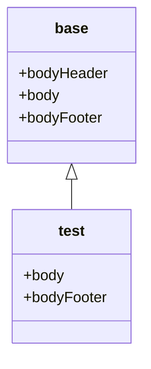

# Twig

<div style="position: relative; padding-bottom: 52.916666666666664%; height: 0;"><iframe src="https://www.loom.com/embed/03f9d867c736446caddf9c542a070c3d" frameborder="0" webkitallowfullscreen mozallowfullscreen allowfullscreen style="position: absolute; top: 0; left: 0; width: 100%; height: 100%;"></iframe></div>

## Pour résumer

- Twig est un moteur de template, il permet d'écrire du HTML plus confortablement, avec de nombreux outils dans nos fichiers `.twig`
  - l'héritage de templates (un template peut hériter d'un autre, et modifier des `block`)
  - les tags `` pour des calculs (dont ``)
  - les moustaches `{{}}` pour afficher des éléments
  - les filtres `|unFiltre()`
  - les fonctions `uneFonction()`
  - des tests
  - les macros
- Pour utiliser Twig, il faut utiliser `$this->render('nomDuTemplate.twig', [])` dans un controller ou appeler le service de rendu de Twig

## Définition

[La documentation officielle de Twig](https://twig.symfony.com/doc/) (qui présente également séparément ce qui vient de Twig ou qui est présent uniquement pour Symfony)

Twig est un moteur de rendu (avec Symfony, vous pouvez tout aussi bien continuer à utiliser PHP, comme nous l'avons vu jusqu'à maintenant) dont le but est de vous simplifier la vie dans la gestion de votre HTML.

## Syntaxe

Twig a sa propre syntaxe, basée sur 5 éléments :
- les tags `` qui vont vous permettre de faire divers calculs
- les moustaches (appellation non-officielle) `{{}}` qui sont là pour afficher du contenu (le contenu d'une variable, le retour d'une fonction ou d'un filtre, etc.)
- les filtres `uneValeurOuVariable | unFiltre(unParamètreDuFiltre)` sont des fonctions dont le premier paramètre se trouve avant le `|` et les suivants dans les parenthèses
- les fonctions `uneFonction(unParamètreDeLaFonction, unSecondParamètre)` plus classiques
- les tests `if uneValeur is unTest(unParamètreDuTest)` vont servir dans des conditions (ainsi que les divers opérateurs, que je vous invite à aller voir par vous-même dans la documentation)


## Transmettre des paramètres

Depuis un controller, vous pouvez transmettre un tableau de paramètres à la vue. 

L'index dans ce tableau correspondra au nom de la variable dans le fichier Twig, la valeur à sa valeur.

```php
public function index(int $page = 1): Response 
{
    $listeDesArticles = [];
    return $this->render('blog/index.html.twig', [
        'page'     => $page,
        // Ici, la vue Twig aura un paramètre articles,
        // indépendant du nom de la variable dans le controller
        'articles' => $listeDesArticles, 
    ]);
}
```

## Les tags

Les tags servent à faire des calculs dans nos vues. On peut les voir comme un équivalent de la balise `<?php ?>` en PHP classique.


### Conditions

La [documentation pour le tag if](https://twig.symfony.com/doc/3.x/tags/if.html)

Un exemple de condition : 

```twig

    <p>Du contenu</p>

    <p>Un contenu alternatif</p>

    <p>Un autre contenu</p>

```

Pour écrire les conditions, vous pouvez utiliser les opérations suivantes :

- [Les opérateurs classiques](https://twig.symfony.com/doc/3.x/templates.html#comparisons) `==`, `!=`, `<`, `>`, `>=`, `<=` pour comparer des éléments, 
- mais aussi `starts with`, `ends with`, `has some`, `has every`, `matches`

```twig
 
```

```twig
 
```

```twig

```

```twig



{# false #}


{# true #}
```

- `in` pour vérifier si un élément est dans un tableau ``
- `is` en conjonction avec d'autres tests (`empty`, `defined`, etc.) : 
```twig
 
```

```twig
 
```
- `same as` est équivalent au `===` de PHP
```twig
 
```


### Boucles

La [documentation du tag for](https://twig.symfony.com/doc/3.x/tags/for.html)

Avec Twig, il n'existe qu'un type de boucle : `for`.

```twig
<ul>
    
        <li>{{ i }}</li>
    
</ul>
```

Pour récupérer les clés et les valeurs du tableau :

```twig
<ul>
    
        <li>{{ key }} : {{ i }}</li>
    
</ul>
```

#### La variable `loop`

Dans les boucles, une variable `loop` est définie (et uniquement dans la boucle) et contient un ensemble d'informations : 
- `loop.index` l'itération en cours de la boucle (commençant par 1)
- `loop.index0` l'itération en cours de la boucle (commençant par 0)
- `loop.revindex` le nombre d'itérations depuis la fin de la boucle (commençant par 1)
- `loop.revindex0` le nombre d'itérations depuis la fin de la boucle (commençant par 0)
- `loop.first` true si c'est la première itération
- `loop.last` true si c'est la dernière itération
- `loop.length` le nombre d'itérations dans la boucle
- `loop.parent` le contexte parent

### `extends` et `block`

La [documentation de extends](https://twig.symfony.com/doc/3.x/tags/extends.html)

Ces deux tags permettent de créer un héritage entre deux vues/templates. Il convient alors de voir nos fichiers `twig` comme des objets, avec une vue parente et des enfants potentiels. Les blocs sont ainsi équivalent aux propriétés que l'on peut surcharger dans les enfants.


Cela permet d'avoir, dans un premier fichier :
- Une structure HTML complète (avec le doctype, `<html>`, `<head>`, `<body>`, etc.)
- Des `block`, permettant de créer des emplacements qui pourront être modifiés (surchargés) par les vues enfants.

Un exemple `templates/base.html.twig` :

```Twig
<!DOCTYPE html>
<html dir="ltr" lang="fr">
    <body>
        {# Ici, nous définissons un ensemble de blocs, qui seront modifiables dans les templates qui héritent de templates/base.html.twig #}
        
            Une valeur par défaut de bodyHeader
        
        
        
        
        
            Une valeur par défaut de bodyFooter
        
        
        
    </body>
</html>
```

Dans un second fichier :
- Une extension de notre vue de base, pour **récupérer toute la structure HTML**, grâce au tag `extends`
- Un appel des différents blocs que l'on **souhaite modifier**

Un exemple, `templates/test/test.html.twig` :

```twig



  Du contenu dans le block bodyFooter



  Du contenu dans le block body

```

:warning: Il est à noter que, dans ce second fichier, on ne surcharge pas le bloc `bodyHeader`. C'est donc le contenu présent dans `base.html.twig` qui sera affiché (car non surchargé).

On peut représenter cet héritage avec ce schéma : 



### include

La [documentation du tag include](https://twig.symfony.com/doc/3.x/tags/include.html) 

:warning: Il existe également une [fonction include](https://twig.symfony.com/doc/3.x/functions/include.html), qui est recommandée et qui a le même fonctionnement.

Ce tag permet d'inclure un template dans un autre. Son fonctionnement est assez similaire au `include` ou au `require` de PHP. 


Son utilisation de base (le fichier `test.html.twig` est à la racine du dossier templates) :

```twig

```

Par défaut, include récupère les variables définies dans le template qui inclut. On peut changer ce comportement :

```twig


```

- Le mot-clé `with` indique à `include` qu'on va créer des variables qu'il devrait utiliser
- `{ 'foo': 'bar' }` est un tableau associatif, dont la clé `foo` va être le nom d'une variable disponible dans le fichier inclut, et `'bar'` sa valeur.
- Dans le cas, la variable `uneVariable` sera également disponible dans `test.html.twig`, car déclarée avant le `include`

Pour aller plus loin, il est possible de ne transmettre **que les variables que l'on déclare** au template inclut, grâce au mot-clé `only` :

```twig


```

- Le mot-clé `with` indique à `include` qu'on va créer des variables qu'il devrait utiliser
- `{ 'foo': 'bar' }` est un tableau associatif, dont la clé `foo` va être le nom d'une variable disponible dans le fichier inclut, et `'bar'` sa valeur.
- Le mot-clé `only` indique qu'il ne faut rien transmettre d'autre au template inclut (la variable `uneVariable`, définie avant le `include` ne sera donc pas présente dans `test.html.twig`)


## Les filtres

Les filtres sont des fonctions particulières, s'appliquant sur des chaines de caractères (mais aussi des objets ou des tableaux). On l'ajoute après la valeur que l'on souhaite transformer et il est séparé de ce dernier par une barre verticale `|`.

Un exemple avec le filtre `capitalize` (qui met en majuscule le premier caractère de chaque mot) :

```twig
{{ 'mon premier filtre'|capitalize }}
{# Affiche 'Mon Premier Filtre' #}
```

### `date`

La [documentation de date](https://twig.symfony.com/doc/3.x/filters/date.html)

Lorsque vous avez un objet `DateTime` à afficher, il faut donner un format d'affichage (sous peine d'avoir une erreur "object of type DateTime could not be converted to string"). Le filtre `date` permet entre autre de régler ce souci.

```twig
{# Depuis un objet #}
{{ article.createdAt|date("d/m/Y") }}

{# Depuis une chaine de caractères #}
{{ 'now'|date("d/m/Y") }}
```

### `format_date`

la [documentation de format_datetime](https://twig.symfony.com/doc/3.x/filters/format_datetime.html)

Ce filtre (pourtant bien pratique) n'est pas fourni par défaut dans Symfony. Il nous faut installer quelques outils supplémentaires :

`composer require twig/intl-extra`
`composer require twig/extra-bundle`


Il existe également les variantes 
- [format_date](https://twig.symfony.com/doc/3.x/filters/format_date.html)
- [format_time](https://twig.symfony.com/doc/3.x/filters/format_time.html)

Ce filtre permet de formater l'affichage d'une date (depuis un objet DateTime ou une chaine de caractères) en fonction d'une langue et d'utiliser des formats standards.

```twig
{{ '2019-08-07 23:39:12'|format_datetime('full', 'full', locale='fr') }}

{# Affiche : mercredi 7 août 2019 23:39:12 UTC #}
```

### `length`

La [documentation de length](https://twig.symfony.com/doc/3.x/filters/length.html)

Ce filtre permet de récupérer la longueur d'une chaine de caractères, le nombre d'éléments dans un tableau.

```twig
{{ 'Une chaine de caractères'|length }}
{# Affiche : 24 #}


```

## Les fonctions

### `asset()`

`asset()` permet de récupérer un fichier (css, image, javascript, etc.) dans le dossier `public` ou l'un de ses sous-dossiers
```twig
{# Ici, on charge l'image qui se trouve dans le dossier public/chemin/vers/une/image.jpg. L'avantage est que nous n'avons plus à gérer le dossier dans lequel nous nous trouvons, Symfony le fait pour nous #}
{{ asset('/chemin/vers/une/image.jpg') }}
```

### `path()`

`path()` permet d'avoir l'URi vers une de vos routes
```twig
{{ path('blog_show', { slug: article.slug }) }}
```

### `url()`

`url()` permet d'avoir une url (complète, avec le http(s), le nom de domaine, etc.)
```twig
{# path prend en premier paramètre le nom d'une route, et en second un "objet" avec les paramètres de la route #}
{{ url('blog_show', { slug: article.slug }) }}
```

### `is_granted()`

[`is_granted()` permet de vérifier si l'utilisateur connecté a des droits](https://symfony.com/doc/current/security.html#security-template).

```twig
{# Si l'utilisateur connecté a le rôle d'administrateur, on affiche un bouton de suppression #}

    <a href="...">Delete</a>

```

### `include()` (fonction)

La [documentation de la fonction include](https://twig.symfony.com/doc/3.x/functions/include.html).

Il s'agit d'une autre manière d'écrire les includes, sous forme de fonction, plutôt que de tag. Cette approche est recommandée par Symfony, car plus souple.

```twig
{# On inclut un template (qui se trouve à la racine du dossier templates) #}
{{ include('template.html.twig') }}


{# On donne un paramètre "foo" à notre template (qui contient la valeur "bar") #}
{{ include('template.html.twig', { foo: 'bar' }) }}

{# On s'assure que notre template ne reçoive que la variable foo (et les variables définies globalement) #}
{{ include('template.html.twig', { foo: 'bar' }, with_context = false) }}
```

## Factoriser le code avec des macros

[Documentation sur les macros](https://twig.symfony.com/doc/3.x/tags/macro.html)

Les macros sont des fonctions, écrites en Twig, permettant de simplifier l'affichage de fragments de code.

L'exemple suivant est directement récupéré de la documentation.

Une déclaration de macro (fichier `forms.html.twig` par exemple) :

```twig
{# On déclare la macro en tant que tag, on lui donne un nom et des paramètres #}

    {# Le contenu va être un twig classique, utilisant les paramètres de la macro uniquement #}
    <input type="{{ type }}" name="{{ name }}" value="{{ value|e }}" size="{{ size }}"/>

```

Pour appeler une macro, il faut inclure son fichier dans le fichier où l'on souhaite l'appeler (un exemple dans `index.html.twig`, dans le même dossier) :

```twig
{# On importe toutes les macros du fichier et on les met dans une variable forms #}


{# ... #}

{# On appelle notre macro, depuis la variable forms (la macro fonctionne ici comme une méthode de forms) #}

```

Il y a de nombreuses manières d'appeler une macro, je vous conseille de vous référer à [la documentation sur les macros](https://twig.symfony.com/doc/3.x/tags/macro.html) pour plus d'informations.

### Personnaliser les pages d'erreur

[La documentation officielle sur le sujet](https://symfony.com/doc/current/controller/error_pages.html)

Pendant le développement (mode `dev` de Symfony), les pages d'erreur sont gérées par Symfony et vous affichent les détails de l'erreur. Bien pratique pour le développement, mais loin de la réalité en production.

Vous pouvez tester le mode `prod` en modifiant la variable `APP_ENV` de votre `.env`. Vous verrez ainsi le site comme vous le verriez sur un serveur, y compris les erreurs.

Il est plus simple de le tester en mode `dev` (changer de mode peut être pénible, surtout pour des questions de cache), et Symfony a tout prévu : 

Créez un fichier `config/routes/dev/framework.yaml` avec le contenu suivant :

```yaml
_errors:
    resource: '@FrameworkBundle/Resources/config/routing/errors.xml'
    prefix:   /_error
```

Pour tester, aller sur `_error/{statusCode}` où `{statusCode}` est le numéro d'erreur de vous voulez tester (404, 500, etc.).

Pour personnaliser les vues, nous pouvons créer des fichiers comme ci-dessous :

```
templates/
└─ bundles/
   └─ TwigBundle/
      └─ Exception/
         ├─ error404.html.twig
         ├─ error403.html.twig
         └─ error.html.twig      # Toutes les autres erreurs HTML (dont les 500)
```

Notez que ce rangement nous permet de [surcharger/modifier les templates de n'importe quel bundle](https://symfony.com/doc/current/bundles/override.html#override-templates).

### Dé-buguer

Dans les vues Twig, vous disposez d'une fonction `dump()` qui vous permet d'afficher le contenu d'une variable et d'en voir le détail (un peu comme un `var_dump`, mais plus complet et mieux mis en forme). Utilisée sans paramètre, la fonction `dump()` affiche toutes es variables disponibles dans la vue.

Il existe également une commande pour vérifier la validité de vos vues Twig

## Exercice

Maintenant, il est temps de passer à l'affichage ! Même si nous n'allons pas utiliser des données réelles, nous allons préparer l'affichage général de nos vues.

Toutes ces vues vont étendre `base.html.twig`.

- Modifier `base.html.twig` pour :
  - inclure Bootstrap (css et js)
  - Créer une navbar avec des liens vers
    - La page d'accueil
    - La liste des articles
- Pour la page de liste des articles, nous allons créer une liste d'articles fictifs, identiques :
  - Créer un fichier `_article.html.twig` que l'on va inclure dans la liste, qui affichera :
    - Un titre
    - Un nom d'utilisateur
    - Un texte (Lorem Ipsum par exemple)
    - Une date (date du jour, au format français)
    - Un lien vers l'article (avec un id arbitraire, comme `12`)
  - Inclure ce fichier en 5 exemplaires, grâce à une boucle `for`
- Pour la page d'un article :
  - Créer un contenu, comme précédemment, mais avec un texte plus long et sans le lien. Est-il nécessaire de créer un nouveau fichier pour ça ? Peut-on utiliser le fichier créé auparavant ?
- Pour la page d'accueil :
  - Ajouter des liens vers des articles, dont les identifiants vont de 32 à 64

Nous allons ignorer les pages de création et modification des articles pour le moment.